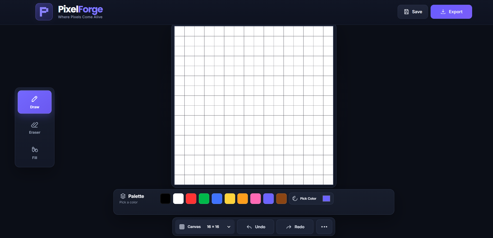
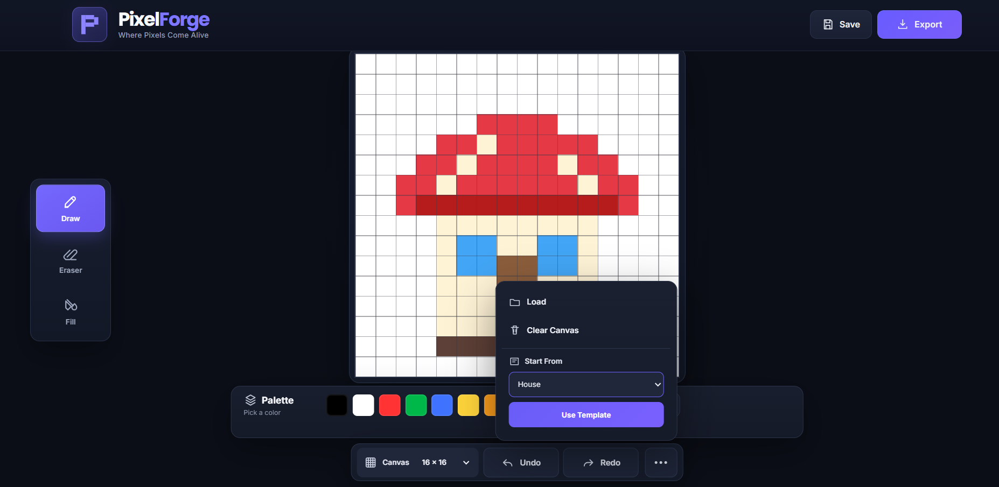

# PixelForge — Where Pixels Come Alive

PixelForge is a modern browser-based pixel art editor built with HTML, CSS, and JavaScript.

## Live Demo

[Open PixelForge](https://susmitha-ae.github.io/PixelForge-Pixel-Art-Studio/)

It provides a simple interface for creating, editing, saving, and exporting pixel art directly in the browser.

## Features

- Pen / Draw tool
- Eraser
- Flood Fill
- Preset color palette
- Custom color picker
- 16 × 16, 32 × 32 and 64 × 64 canvas sizes
- Undo and Redo
- Save and Load artwork
- Clear canvas
- PNG export
- Pixel-art templates
- Hover preview
- Keyboard shortcuts
- Responsive dark-themed interface

## Tech Stack

- HTML5
- CSS3
- JavaScript
- HTML Canvas API
- Local Storage

## Keyboard Shortcuts

| Key | Action |
|---|---|
| P | Draw |
| E | Eraser |
| F | Fill |
| Ctrl + Z | Undo |
| Ctrl + Y | Redo |
| Ctrl + Shift + Z | Redo |

## Screenshots

### Main Editor

### Features

## Project Structure

PixelForge/
├── index.html
├── css/
│   └── style.css
├── js/
│   └── app.js
├── screenshots/
│   ├── editor-main.png
│   └── editor-features.png
└── README.md

## Author

Susmitha A.E.